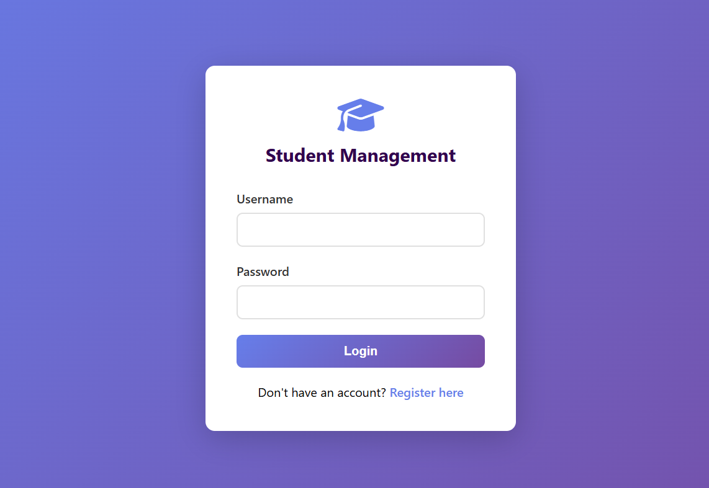
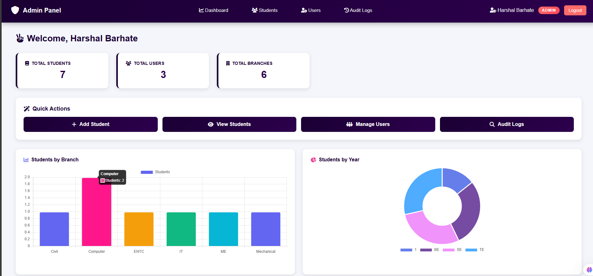
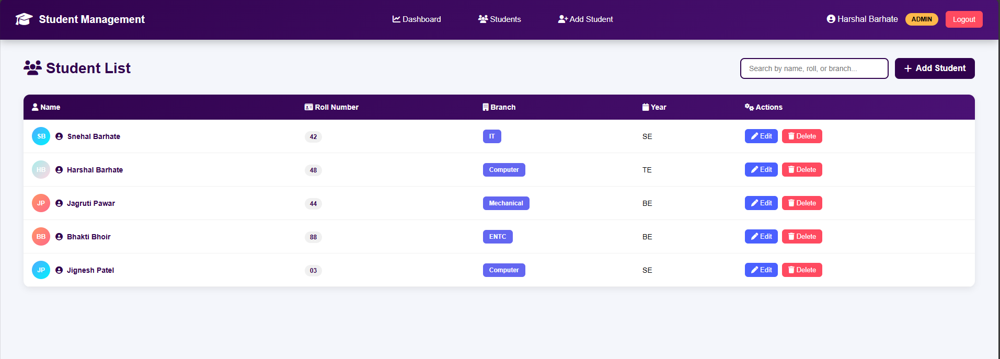
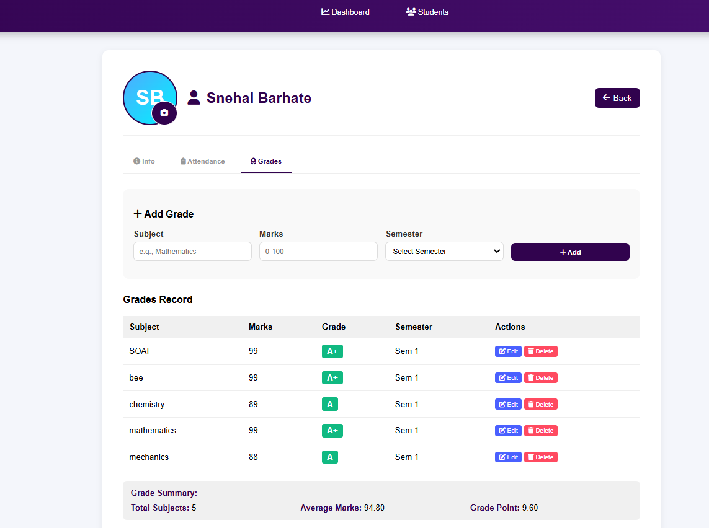

# 📚 Student Management System

A full-stack web application for managing student records with authentication and CRUD operations.  
Built using **Flask (Python)** with a **responsive HTML/CSS/JavaScript frontend**, and deployed on **Render**.

🔗 **Live Demo:** https://student-management-system-4ptl.onrender.com  
📂 **GitHub Repository:** https://github.com/Harshal-Bsys27/student-management-system  

> ⚠️ Note: The application may take up to **30–60 seconds** to load on first visit due to free hosting (cold start on Render).

---

## ✨ Features

- User authentication (Login & Registration)
- Add, update, and delete student records
- Dashboard view for student management
- Secure session-based access
- Responsive UI using Bootstrap
- Production deployment using Gunicorn

---

## 🛠️ Tech Stack

### Backend
- Python
- Flask
- SQLite
- Werkzeug
- Flask-CORS

### Frontend
- HTML
- CSS
- JavaScript
- Bootstrap
- Font Awesome

### Deployment
- Render
- Gunicorn

---

## 📸 Screenshots

| Login Page | Dashboard |
|------------|-----------|
|  |  |

| Student List |
|--------------|
|  |  |

---

## 📁 Project Structure

```text
student-management-system/
│
├── backend/
│   ├── app.py
│   └── __init__.py
│
├── templates/
│
├── static/
│   └── css/
│
├── screenshots/
│   ├── login.png
│   ├── dashboard.png
│   └── students.png
│
├── requirements.txt
└── README.md


---

## ⚙️ Run Locally

### Prerequisites
- Python 3.9+
- pip

### Setup
```bash
git clone https://github.com/Harshal-Bsys27/student-management-system.git
cd student-management-system
python -m venv venv
source venv/bin/activate   # Windows: venv\Scripts\activate
pip install -r requirements.txt

cd backend
flask run
Visit:

http://127.0.0.1:5000

## 🚀 Deployment

This application is deployed on **Render** using **Gunicorn**.

**Start Command:**
```bash
gunicorn backend.app:app
🧠 What I Learned

Structuring Flask applications for production

Implementing authentication and CRUD operations

Deploying Python web apps on Render

Debugging Gunicorn and environment issues
## ⚙️ Future Improvements

Role-based access (Admin / User)

PostgreSQL database integration

Search and pagination

REST API documentation

Improved UI/UX

## 👤 Author

Harshal Vasudev Barhate

GitHub: https://github.com/Harshal-Bsys27

LinkedIn: https://www.linkedin.com/in/harshalbarhate778945ag/

Email: harshalbarhate2028@gmail.com
